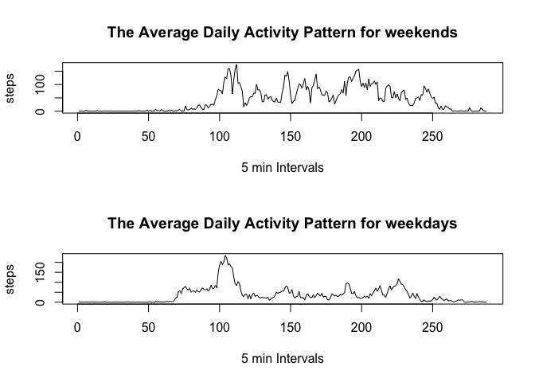

# Reproducible Research: Peer Assessment 1


## Loading and preprocessing the data

We fork/clone the GitHub repository created for this assignment,and load data by "read.csv" command.
Then we process data into a format suitable for our analysis.


```r
library(lubridate)  
o_ac<-read.csv('activity.csv')  
ac<-na.omit(o_ac)  
ac[,2]<-ymd(ac[,2])  
ac[,3]<-as.numeric(ac[,3])
ac[,1]<-as.numeric(ac[,1])
ac[,2]<-factor(ac[,2])
```

## What is mean total number of steps taken per day?

We are going to calculate the total number of steps taken for each day,and make a histogram of the total number of steps taken each day.Next, we need to calculate and report the mean and median total number of steps taken per day.


```r
totalstep<-tapply(ac[,1],ac[,2],sum)  
hist(totalstep,xlab="date",ylab="steps",main="The total number of steps per day" )
xscale<-dimnames(totalstep)  
#axis.Date(1,at=seq(min(xscale[[1]]),max(xscale[[1]]),"days"))  
meanstep<-round(mean(totalstep),1)  
medianstep<-round(median(totalstep),1)  
abline(v=meanstep,lwd = 8,col="blue")  
abline(v=medianstep,lwd = 3,col="red")  
legend('topright', lty = 1, lwd = 3, col = c("blue", "red"),
               legend = c(paste('Mean: ', meanstep),
               paste('Median: ', medianstep))
               )  
```

 


## What is the average daily activity pattern?

We make a time series plot of the 5-minute interval (x-axis) and the average number of steps taken, averaged across all days.Then  across all the days in the dataset on average, the 5-minute interval contains the maximum number of steps is 8:35 am.


```r
avgp<-tapply(ac[,1],ac[,3],mean)
plot(x=seq(1:length(avgp)),y=avgp,type="l",xlab = "5 min Intervals", 
     ylab = "Steps", 
     main = "The Average Daily Activity Pattern")
```

 

```r
time<-avgp[which.max(avgp)]
time
```

     835 
206.1698 

## Imputing missing values

we calculate the total number of missing values in the dataset. the total number of missing values in the dataset is 2304.The strategy we are going implement for imputing missing values is to use the mean for the 5-minute interval.Then we calculate he total number of steps taken for each day, and then make a histogram of the total number of steps taken each day,and the mean and median total number of steps taken per day.


```r
sum(!complete.cases(o_ac))
```

[1] 2304

```r
new_ac<-o_ac
new_ac[is.na(o_ac[,1]),1]<-avgp[as.character(o_ac[is.na(o_ac[,1]),3])]
newtotalstep<-tapply(new_ac[,1],new_ac[,2],sum)  
hist(newtotalstep,xlab="date",ylab="steps",main="The total number of steps per day" )
xscale<-dimnames(newtotalstep)  
#axis.Date(1,at=seq(min(xscale[[1]]),max(xscale[[1]]),"days"))  
newmeanstep<-round(mean(newtotalstep),1)  
newmedianstep<-round(median(newtotalstep),1)  
abline(v=newmeanstep,lwd = 8,col="blue")  
abline(v=newmedianstep,lwd = 3,col="red")  
legend('topright', lty = 1, lwd = 3, col = c("blue", "red"),
               legend = c(paste('Mean: ', newmeanstep),
               paste('Median: ', newmedianstep))
               )  
```

 

## Are there differences in activity patterns between weekdays and weekends?

we can get weekday by wday command,then we separate data indicating whether a given date is a weekday or weekend day.finally,we  make two plot containing a time series plot (i.e. type = “l”) of the 5-minute interval (x-axis) and the average number of steps taken, averaged across all weekday days or weekend days (y-axis).


```r
wac<-wday(ac[,2])
lwac<-wac==1 | wac ==7
wkends<-ac[lwac==TRUE,]
wdays<-ac[lwac==FALSE,]
wkend_avgp<-tapply(wkends[,1],wkends[,3],mean)
wdays_avgp<-tapply(wdays[,1],wdays[,3],mean)
n_avgp<-cbind(wkend_avgp,wdays_avgp)
par(mfcol = c(2, 1)) 

  #first plot
   plot(x=seq(1:length(n_avgp[,1])),y=n_avgp[,1],type="l",xlab = "5 min Intervals", 
     ylab = "steps", 
     main = "The Average Daily Activity Pattern for weekends")
  #second plot
    plot(x=seq(1:length(n_avgp[,1])),y=n_avgp[,2],type="l",xlab = "5 min Intervals", 
     ylab = "steps", 
     main = "The Average Daily Activity Pattern for weekdays")
```

 
